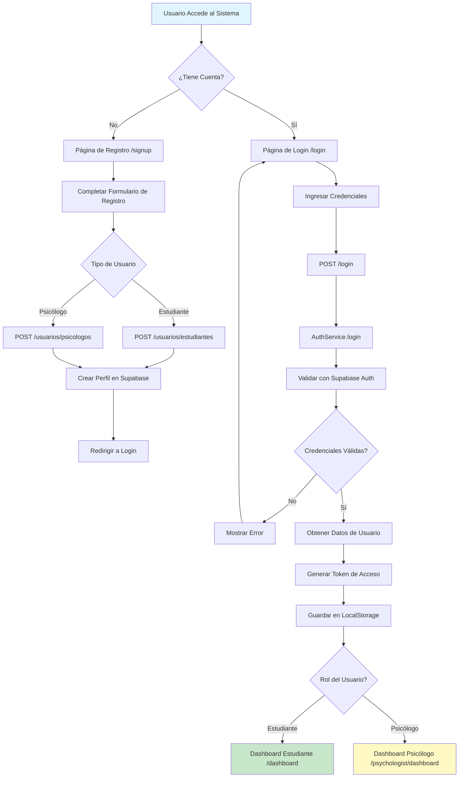
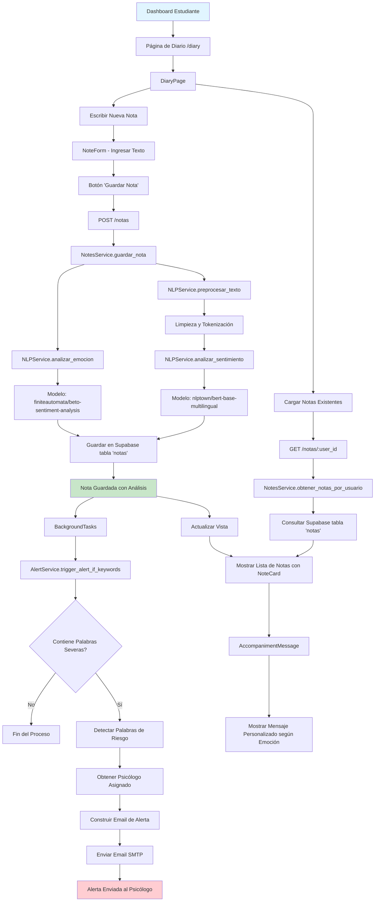
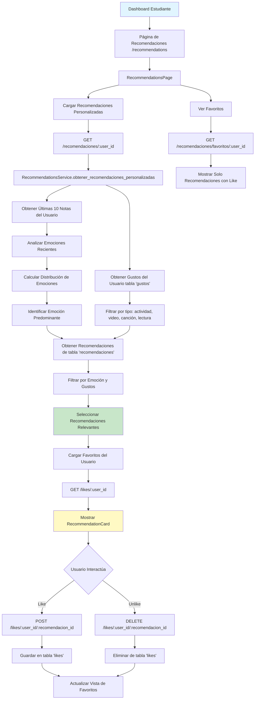
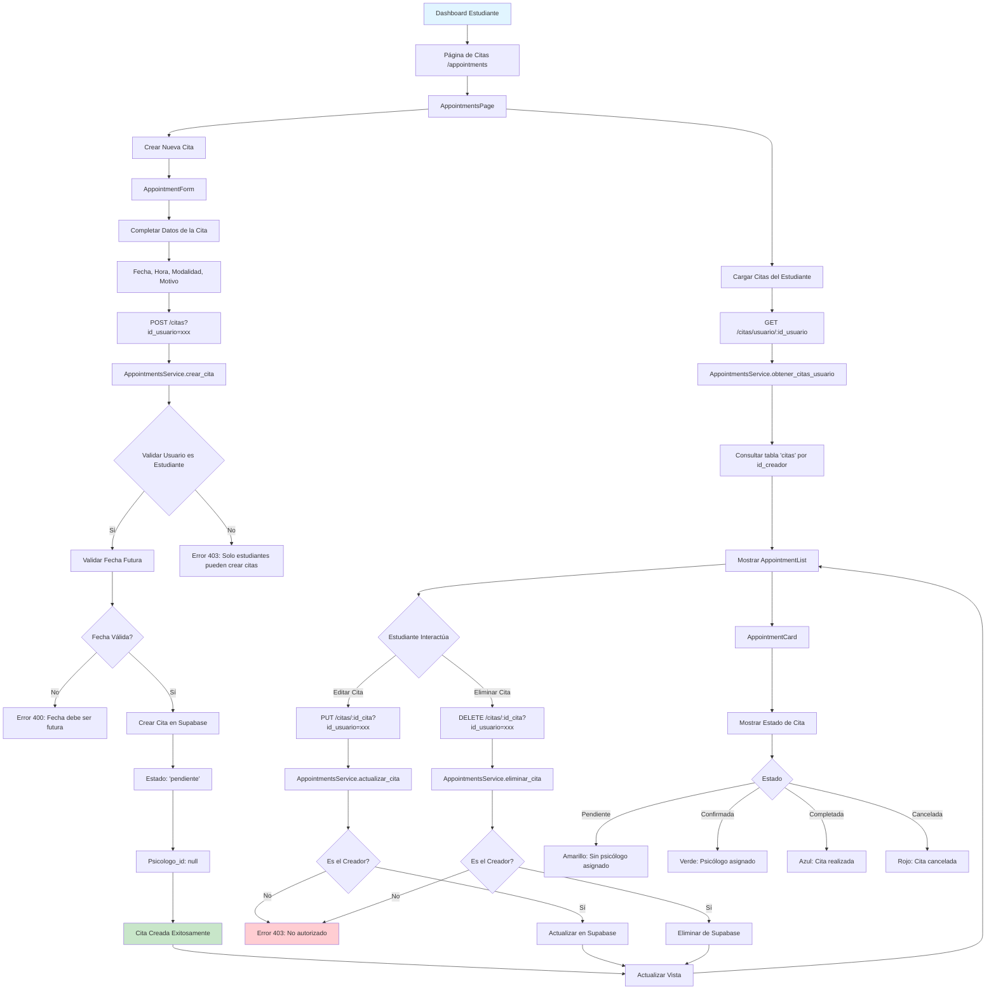
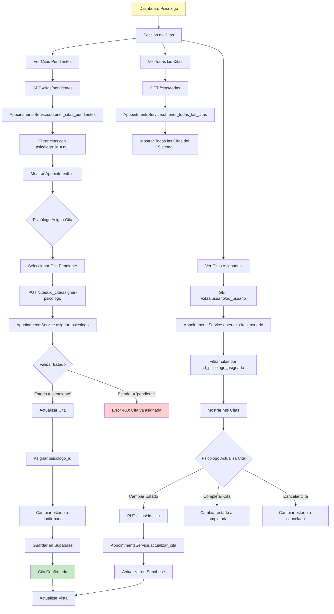
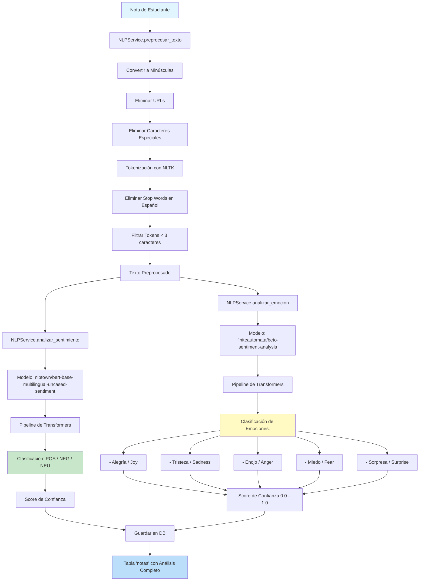
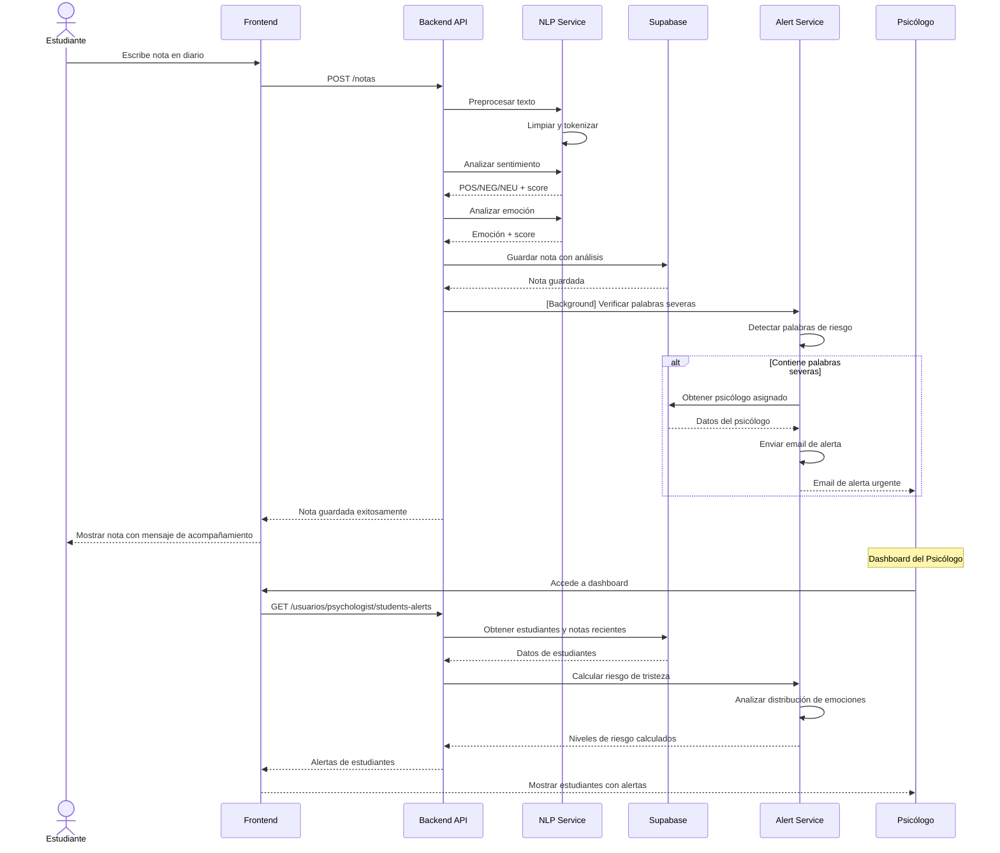

# Diagrama de Flujo Principal - Sistema UNAYOE

## Descripción General
Sistema de apoyo psicológico universitario que permite a estudiantes registrar emociones en un diario digital, recibir recomendaciones personalizadas, agendar citas y monitorear su bienestar emocional. Los psicólogos pueden monitorear estudiantes, detectar alertas de riesgo y gestionar citas asignadas.

---

## 1. Flujo de Autenticación y Registro



---

## 2. Flujo Principal - Estudiante

### 2.1 Gestión del Diario Emocional



**Palabras Clave de Riesgo Monitoreadas:**
- morir, muerte, suicidio, lastimarme, quitarme la vida, autolesión, cortarme
- Frases: "no quiero vivir", "me quiero morir", "no tengo ganas de vivir"

---

### 2.2 Sistema de Recomendaciones Personalizadas



**Tipos de Recomendaciones:**
- Actividades (ejercicio, meditación, salidas)
- Videos (motivacionales, educativos)
- Canciones (relajantes, energizantes)
- Lecturas (libros, artículos)

---

### 2.3 Gestión de Citas Psicológicas



**Estados de Citas:**
- **Pendiente**: Cita creada, sin psicólogo asignado
- **Confirmada**: Psicólogo asignado, pendiente de realizar
- **Completada**: Cita realizada
- **Cancelada**: Cita cancelada

---

## 3. Flujo Principal - Psicólogo

### 3.1 Dashboard y Monitoreo de Estudiantes

```mermaid
graph TD
    A[Dashboard Psicólogo] --> B[/psychologist/dashboard]
    B --> C[PsychologistDashboardPage]
    C --> D[Cargar Estudiantes con Alertas]
    D --> E[GET /usuarios/psychologist/students-alerts?psychologist_id=xxx]
    E --> F[AlertService.get_students_with_alerts]

    F --> G[Obtener Estudiantes Asignados]
    G --> H[Filtrar por psicologo_id si se proporciona]
    H --> I[Para Cada Estudiante]

    I --> J[Obtener Últimas N Notas tabla 'notas']
    J --> K[AlertService.compute_sadness_risk]
    K --> L[Analizar Emociones de las Notas]

    L --> M{Detectar Emoción 'Tristeza'}
    M --> N[Calcular Métricas de Riesgo]
    N --> O[count: total de notas analizadas]
    O --> P[sad_count: notas con tristeza]
    P --> Q[ratio: sad_count / count]
    Q --> R[max_sad_score: score máximo de tristeza]
    R --> S[latest_sad_score: score de última nota]

    S --> T{Determinar Nivel de Riesgo}
    T -->|latest_sad_score >= 0.9 O ratio >= 0.6| U[RIESGO ALTO]
    T -->|ratio >= 0.4 O max_sad_score >= 0.75| V[RIESGO MEDIO]
    T -->|ratio > 0| W[RIESGO BAJO]
    T -->|Ninguna tristeza| X[SIN RIESGO]

    U --> Y[AlertCard - Rojo]
    V --> Z[AlertCard - Naranja]
    W --> AA[AlertCard - Amarillo]
    X --> AB[StudentCard - Verde]

    Y --> AC[Mensaje: ALERTA - Posibles tendencias depresivas]
    Z --> AD[Mensaje: Atención - Señales moderadas de tristeza]
    W --> AE[Mensaje: Leves señales de tristeza]
    X --> AF[Mensaje: Sin señales de tristeza]

    C --> AG[AlertList - Mostrar Alertas Ordenadas]
    AG --> AH{Psicólogo Selecciona Estudiante}
    AH --> AI[StudentDetailModal]
    AI --> AJ[Mostrar Información Completa]
    AJ --> AK[Nombre, Código, Nivel de Riesgo]
    AK --> AL[Historial de Notas Recientes]
    AL --> AM[Análisis de Sentimientos]

    C --> AN[Ver Todos los Estudiantes]
    AN --> AO[GET /usuarios/psychologist/students?psychologist_id=xxx]
    AO --> AP[UsersService.obtener_estudiantes]
    AP --> AQ[StudentList]

    style A fill:#fff9c4
    style U fill:#ffcdd2
    style V fill:#ffe0b2
    style W fill:#fff9c4
    style X fill:#c8e6c9
```

**Criterios de Alertas:**
- **Alto**: Última nota con score >= 0.9 de tristeza O 60%+ notas tristes
- **Medio**: 40%+ notas tristes O score máximo >= 0.75
- **Bajo**: Al menos una nota con tristeza
- **Sin riesgo**: Ninguna nota con tristeza

---

### 3.2 Gestión de Citas (Psicólogo)



---

### 3.3 Análisis y Exportación de Datos

```mermaid
graph TD
    A[Dashboard Psicólogo] --> B[Seleccionar Estudiante]
    B --> C[Acceder a Análisis de Estudiante]
    C --> D[GET /analyze/:user_id]
    D --> E[AnalysisService.analizar_multiples_notas]

    E --> F[Obtener Notas del Estudiante]
    F --> G[NotesService.obtener_notas_por_usuario]
    G --> H[Procesar Cada Nota]

    H --> I[Crear DataFrame con Pandas]
    I --> J[Columnas: fecha, nota, sentimiento, emoción, score]
    J --> K[AnalysisService.crear_visualizaciones]

    K --> L[Gráfico 1: Distribución de Emociones]
    K --> M[Gráfico 2: Evolución Temporal del Sentimiento]
    K --> N[Gráfico 3: Scores de Confianza de Emociones]

    L --> O[Matplotlib - Generar Gráfico]
    M --> O
    N --> O
    O --> P[Convertir a Base64]
    P --> Q[Retornar JSON con Imágenes]

    Q --> R[Mostrar Visualizaciones en Frontend]

    C --> S[Exportar Reporte]
    S --> T[GET /export/:user_id]
    T --> U[AnalysisService - Generar CSV]
    U --> V[Crear DataFrame Analizado]
    V --> W[DataFrame.to_csv]
    W --> X[StreamingResponse]
    X --> Y[Descargar archivo reporte_diario_[user_id].csv]

    Y --> Z[Archivo CSV con:]
    Z --> AA[- Fecha de cada nota]
    Z --> AB[- Texto de la nota]
    Z --> AC[- Sentimiento detectado]
    Z --> AD[- Emoción detectada]
    Z --> AE[- Score de confianza]

    style A fill:#fff9c4
    style Q fill:#c8e6c9
    style Y fill:#bbdefb
```

**Visualizaciones Generadas:**
1. **Distribución de Emociones**: Gráfico de barras con frecuencia de cada emoción
2. **Evolución Temporal**: Línea de tiempo mostrando cambios de sentimiento
3. **Scores de Confianza**: Análisis de certeza de las predicciones

---

## 4. Flujo de Procesamiento NLP



**Modelos de Machine Learning Utilizados:**
- **Sentimiento**: nlptown/bert-base-multilingual-uncased-sentiment
- **Emoción**: finiteautomata/beto-sentiment-analysis (BETO - BERT en Español)
- **Fallback**: distilbert-base-uncased (si fallan los anteriores)

---

## 5. Arquitectura del Sistema

### 5.1 Backend (FastAPI)

```
backend/
├── app/
│   ├── routers/
│   │   ├── auth.py              # POST /login
│   │   ├── users.py             # Gestión de estudiantes y psicólogos
│   │   ├── notes.py             # GET /notas/:user_id, POST /notas
│   │   ├── appointments.py      # CRUD de citas
│   │   ├── recommendations.py   # GET /recomendaciones/:user_id, likes
│   │   └── analysis.py          # GET /analyze/:user_id, /export/:user_id
│   ├── services/
│   │   ├── auth_service.py      # Autenticación con Supabase
│   │   ├── users_service.py     # Lógica de usuarios
│   │   ├── notes_service.py     # Gestión de notas
│   │   ├── appointments_service.py  # Lógica de citas
│   │   ├── recommendations_service.py  # Algoritmo de recomendaciones
│   │   ├── nlp_service.py       # Procesamiento NLP (Singleton)
│   │   ├── analysis_service.py  # Análisis y visualizaciones
│   │   └── alert_service.py     # Sistema de alertas y emails
│   ├── models/
│   │   └── schemas.py           # Pydantic models
│   ├── db/
│   │   └── supabase.py          # Cliente de Supabase
│   └── config/
│       └── settings.py          # Configuración y variables de entorno
```

### 5.2 Frontend (React + TypeScript)

```
frontend/src/
├── features/
│   ├── auth/                    # Login/Signup
│   ├── diary/                   # Diario emocional
│   ├── appointments/            # Gestión de citas
│   ├── recommendations/         # Recomendaciones personalizadas
│   └── psychologist/            # Dashboard psicólogo
├── shared/
│   ├── components/
│   │   ├── layout/              # Header, Sidebar, Layouts
│   │   └── ui/                  # Componentes reutilizables
│   ├── hooks/                   # Custom hooks
│   └── utils/                   # Utilidades
├── core/
│   ├── api/
│   │   └── client.ts            # Cliente HTTP
│   ├── types/
│   │   └── index.ts             # Tipos TypeScript
│   └── config/
│       └── constants.ts         # Constantes
└── app/
    └── router/
        └── routes.tsx           # Definición de rutas
```

---

## 6. Base de Datos (Supabase)

### Tablas Principales:

**usuarios**
- id (PK)
- email
- nombre, apellido
- rol: 'estudiante' | 'psicologo'
- codigo_alumno (estudiantes)
- psicologo_id (FK a usuarios, para estudiantes)

**notas**
- id (PK)
- usuario_id (FK)
- texto
- sentimiento: 'POS' | 'NEG' | 'NEU'
- emocion: 'alegria' | 'tristeza' | 'enojo' | 'miedo' | 'sorpresa'
- emocion_score (0.0 - 1.0)
- created_at

**citas**
- id (PK)
- id_creador (FK a usuarios - estudiante)
- id_psicologo_asignado (FK a usuarios - psicólogo)
- fecha_hora
- modalidad: 'presencial' | 'virtual'
- motivo
- estado: 'pendiente' | 'confirmada' | 'completada' | 'cancelada'

**recomendaciones**
- id (PK)
- titulo
- descripcion
- tipo: 'actividad' | 'video' | 'cancion' | 'lectura'
- emocion_objetivo
- link (opcional)

**likes**
- id (PK)
- usuario_id (FK)
- recomendacion_id (FK)

**gustos**
- id (PK)
- usuario_id (FK)
- tipo_gusto: 'actividad' | 'video' | 'cancion' | 'lectura'

---

## 7. Flujo de Datos Completo



---

## 8. Tecnologías Utilizadas

### Backend
- **Framework**: FastAPI (Python)
- **Base de Datos**: Supabase (PostgreSQL)
- **NLP**:
  - Transformers (Hugging Face)
  - NLTK
  - Modelos: BETO, BERT multilingual
- **Análisis**:
  - Pandas
  - Matplotlib
- **Email**: SMTP (Gmail)

### Frontend
- **Framework**: React 18
- **Lenguaje**: TypeScript
- **Routing**: React Router v6
- **Estado**: Zustand
- **Estilos**: Tailwind CSS
- **HTTP**: Axios

### Infraestructura
- **Auth**: Supabase Auth
- **Storage**: Supabase Storage
- **Real-time**: Supabase Realtime (opcional)

---

## 9. Casos de Uso Críticos

### 9.1 Detección de Riesgo Suicida
1. Estudiante escribe nota con palabras como "suicidio" o "no quiero vivir"
2. NLP analiza y guarda la nota
3. Alert Service detecta palabras severas en background
4. Sistema envía email inmediato al psicólogo asignado
5. Psicólogo recibe alerta con contexto de la nota
6. Dashboard del psicólogo muestra estudiante con RIESGO ALTO

### 9.2 Recomendaciones Adaptativas
1. Estudiante tiene 7 de 10 últimas notas con emoción "tristeza"
2. Sistema identifica tristeza como emoción predominante
3. Usuario tiene gustos registrados: "música", "lectura"
4. Algoritmo filtra recomendaciones para tristeza + gustos del usuario
5. Frontend muestra recomendaciones personalizadas:
   - Canciones relajantes (gusto: música)
   - Lecturas motivacionales (gusto: lectura)
   - Actividades de bienestar

### 9.3 Seguimiento Longitudinal
1. Psicólogo accede a análisis de estudiante
2. Sistema genera gráficos de evolución emocional
3. Visualiza tendencias: ¿Mejora o empeora?
4. Exporta CSV con datos completos para análisis externo
5. Toma decisiones informadas sobre intervención

---

## Resumen de Endpoints Principales

### Autenticación
- `POST /login` - Iniciar sesión

### Usuarios
- `POST /usuarios/estudiantes` - Crear estudiante
- `POST /usuarios/psicologos` - Crear psicólogo
- `GET /usuarios/psychologist/students` - Listar estudiantes
- `GET /usuarios/psychologist/students-alerts` - Estudiantes con alertas

### Notas
- `GET /notas/:user_id` - Obtener notas de un usuario
- `POST /notas` - Guardar nota (con análisis NLP)

### Citas
- `POST /citas` - Crear cita (solo estudiantes)
- `GET /citas/pendientes` - Citas sin asignar
- `GET /citas/usuario/:id_usuario` - Citas de un usuario
- `PUT /citas/:id_cita/asignar-psicologo` - Asignar psicólogo
- `PUT /citas/:id_cita` - Actualizar cita
- `DELETE /citas/:id_cita` - Eliminar cita

### Recomendaciones
- `GET /recomendaciones/:user_id` - Recomendaciones personalizadas
- `GET /recomendaciones/favoritos/:user_id` - Favoritos del usuario
- `POST /likes/:user_id/:recomendacion_id` - Agregar like
- `DELETE /likes/:user_id/:recomendacion_id` - Quitar like

### Análisis
- `GET /analyze/:user_id` - Análisis con gráficos
- `GET /export/:user_id` - Exportar reporte CSV

---

**Fecha de Creación**: 2025-12-04
**Sistema**: UNAYOE - Plataforma de Apoyo Psicológico Universitario
