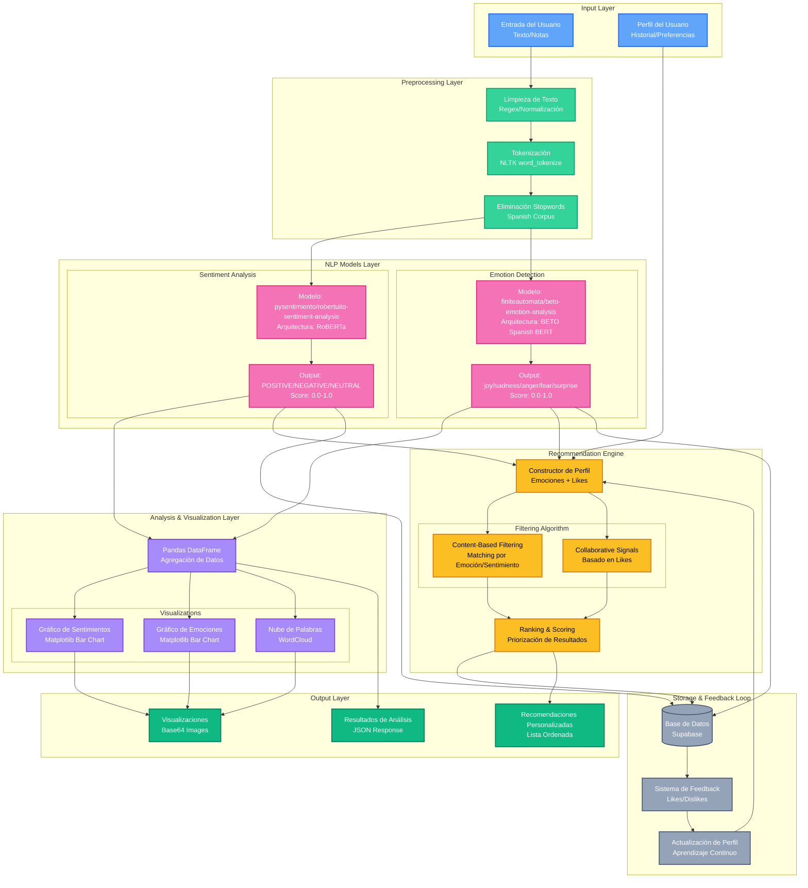

# 🏗️ Arquitectura del Sistema UNAYOE

## 📋 Tabla de Contenidos
- [Arquitectura General del Sistema](#arquitectura-general-del-sistema)
- [Arquitectura de la Solución IA](#arquitectura-de-la-solución-ia)
- [Flujo Principal del Sistema](#flujo-principal-del-sistema)

---

## Arquitectura General del Sistema

### Diagrama de Arquitectura de Software

```mermaid
graph TB
    subgraph "Cliente / Frontend"
        UI[Interface de Usuario<br/>React/Vue/Angular]
        AUTH[Módulo de Autenticación]
        DASH[Dashboard Estudiante]
        ADMIN[Dashboard Admin]
        PSI[Dashboard Psicólogo]
    end

    subgraph "API Layer - FastAPI"
        GATEWAY[API Gateway<br/>FastAPI Main]
        
        subgraph "Routers"
            R_AUTH[Auth Router<br/>/login]
            R_USERS[Users Router<br/>/usuarios]
            R_NOTES[Notes Router<br/>/notas]
            R_ANALYSIS[Analysis Router<br/>/analyze]
            R_RECS[Recommendations Router<br/>/recomendaciones]
            R_APPTS[Appointments Router<br/>/citas]
        end
        
        subgraph "Services Layer"
            S_AUTH[Auth Service]
            S_USERS[Users Service]
            S_NOTES[Notes Service]
            S_NLP[NLP Service<br/>Transformers]
            S_ANALYSIS[Analysis Service<br/>Pandas/Matplotlib]
            S_RECS[Recommendations Service<br/>ML-Based]
            S_APPTS[Appointments Service]
        end
    end

    subgraph "AI/ML Layer"
        NLP_MODELS[Modelos NLP]
        SENTIMENT[Análisis de Sentimientos<br/>pysentimiento]
        EMOTION[Análisis de Emociones<br/>beto-emotion]
        VISUAL[Generación de Visualizaciones<br/>WordCloud/Matplotlib]
        REC_ENGINE[Motor de Recomendaciones<br/>Content-Based Filtering]
    end

    subgraph "Data Layer"
        SUPABASE[(Supabase PostgreSQL)]
        
        subgraph "Tablas"
            T_USERS[usuarios]
            T_NOTES[notas]
            T_RECS[recomendaciones]
            T_LIKES[likes_recomendaciones]
            T_APPTS[citas]
        end
    end

    subgraph "External Services"
        NLTK[NLTK Resources<br/>Stopwords/Tokenizers]
        TORCH[PyTorch<br/>Deep Learning Backend]
        HF[Hugging Face<br/>Model Hub]
    end

    %% Conexiones Frontend -> API
    UI --> GATEWAY
    AUTH --> R_AUTH
    DASH --> R_NOTES
    DASH --> R_ANALYSIS
    DASH --> R_RECS
    DASH --> R_APPTS
    ADMIN --> R_USERS
    ADMIN --> R_APPTS
    PSI --> R_APPTS

    %% Conexiones API Gateway -> Routers
    GATEWAY --> R_AUTH
    GATEWAY --> R_USERS
    GATEWAY --> R_NOTES
    GATEWAY --> R_ANALYSIS
    GATEWAY --> R_RECS
    GATEWAY --> R_APPTS

    %% Conexiones Routers -> Services
    R_AUTH --> S_AUTH
    R_USERS --> S_USERS
    R_NOTES --> S_NOTES
    R_ANALYSIS --> S_ANALYSIS
    R_ANALYSIS --> S_NLP
    R_RECS --> S_RECS
    R_APPTS --> S_APPTS

    %% Conexiones Services -> AI/ML
    S_NOTES --> S_NLP
    S_ANALYSIS --> S_NLP
    S_ANALYSIS --> VISUAL
    S_NLP --> NLP_MODELS
    S_NLP --> SENTIMENT
    S_NLP --> EMOTION
    S_RECS --> REC_ENGINE

    %% Conexiones AI/ML -> External
    NLP_MODELS --> HF
    NLP_MODELS --> TORCH
    S_NLP --> NLTK

    %% Conexiones Services -> Database
    S_AUTH --> SUPABASE
    S_USERS --> SUPABASE
    S_NOTES --> SUPABASE
    S_RECS --> SUPABASE
    S_APPTS --> SUPABASE

    %% Conexiones Database Tables
    SUPABASE --> T_USERS
    SUPABASE --> T_NOTES
    SUPABASE --> T_RECS
    SUPABASE --> T_LIKES
    SUPABASE --> T_APPTS

    %% Estilos
    classDef frontend fill:#60A5FA,stroke:#2563EB,stroke-width:2px,color:#fff
    classDef api fill:#34D399,stroke:#059669,stroke-width:2px,color:#fff
    classDef service fill:#A78BFA,stroke:#7C3AED,stroke-width:2px,color:#fff
    classDef ai fill:#F472B6,stroke:#DB2777,stroke-width:2px,color:#fff
    classDef data fill:#FBBF24,stroke:#D97706,stroke-width:2px,color:#000
    classDef external fill:#94A3B8,stroke:#475569,stroke-width:2px,color:#fff

    class UI,AUTH,DASH,ADMIN,PSI frontend
    class GATEWAY,R_AUTH,R_USERS,R_NOTES,R_ANALYSIS,R_RECS,R_APPTS api
    class S_AUTH,S_USERS,S_NOTES,S_NLP,S_ANALYSIS,S_RECS,S_APPTS service
    class NLP_MODELS,SENTIMENT,EMOTION,VISUAL,REC_ENGINE ai
    class SUPABASE,T_USERS,T_NOTES,T_RECS,T_LIKES,T_APPTS data
    class NLTK,TORCH,HF external
```

### Descripción de Componentes

#### **Frontend Layer**
- **Interface de Usuario**: Aplicación web moderna con React/Vue
- **Módulo de Autenticación**: Gestión de sesiones y tokens
- **Dashboards**: Interfaces específicas por rol (Estudiante, Admin, Psicólogo)

#### **API Layer (FastAPI)**
- **API Gateway**: Punto de entrada único con middleware CORS
- **Routers**: Endpoints REST organizados por dominio
- **Services**: Lógica de negocio y orquestación

#### **AI/ML Layer**
- **NLP Service**: Procesamiento de lenguaje natural
- **Sentiment Analysis**: Detección de sentimientos (positivo/negativo)
- **Emotion Analysis**: Clasificación de emociones (alegría, tristeza, etc.)
- **Recommendation Engine**: Sistema de recomendaciones basado en contenido

#### **Data Layer**
- **Supabase PostgreSQL**: Base de datos relacional en la nube
- **Tablas**: usuarios, notas, recomendaciones, likes, citas

---

## Arquitectura de la Solución IA

### Diagrama de Arquitectura IA

### Descripción de la Solución IA

#### **1. Preprocessing Layer**
- **Limpieza**: Eliminación de URLs, caracteres especiales, normalización
- **Tokenización**: División del texto en tokens usando NLTK
- **Stopwords**: Filtrado de palabras comunes en español

#### **2. NLP Models**
- **Sentiment Model**: `pysentimiento/robertuito-sentiment-analysis`
  - Basado en RoBERTa entrenado en español
  - Clasifica: POSITIVE, NEGATIVE, NEUTRAL
  
- **Emotion Model**: `finiteautomata/beto-emotion-analysis`
  - Basado en BETO (Spanish BERT)
  - Clasifica: joy, sadness, anger, fear, surprise

#### **3. Analysis & Visualization**
- **Pandas**: Agregación y análisis de datos
- **Matplotlib**: Gráficos de barras para distribuciones
- **WordCloud**: Visualización de palabras frecuentes

#### **4. Recommendation Engine**
- **Content-Based Filtering**: Matching por emoción y sentimiento
- **Collaborative Signals**: Basado en likes de usuarios
- **Perfil Dinámico**: Se actualiza con cada interacción

---

## Flujo Principal del Sistema

### Diagrama de Flujo: Citas + Asistencia IA

```mermaid
flowchart TD
    START([Inicio: Usuario Ingresa al Sistema])
    LOGIN{¿Usuario<br/>Autenticado?}
    AUTH[Autenticación<br/>Login/Registro]
    
    ROLE_CHECK{Rol del<br/>Usuario}
    
    %% Flujo Estudiante
    STUDENT_DASH[Dashboard Estudiante]
    STUDENT_ACTION{Acción del<br/>Estudiante}
    
    %% Flujo de Notas y Análisis IA
    CREATE_NOTE[Crear Nueva Nota<br/>Texto Libre]
    SAVE_NOTE[Guardar Nota en BD]
    AI_PROCESS[Procesamiento IA<br/>NLP Service]
    AI_SENTIMENT[Análisis de Sentimientos<br/>RoBERTa Model]
    AI_EMOTION[Análisis de Emociones<br/>BETO Model]
    SAVE_ANALYSIS[Guardar Análisis<br/>Sentimiento + Emoción]
    
    VIEW_ANALYSIS[Ver Análisis Completo]
    GENERATE_VIZ[Generar Visualizaciones<br/>Gráficos + WordCloud]
    SHOW_VIZ[Mostrar Dashboard<br/>Análisis Visual]
    
    %% Flujo de Recomendaciones IA
    VIEW_RECS[Ver Recomendaciones]
    BUILD_PROFILE[Construir Perfil Usuario<br/>Últimas 5 Notas + Likes]
    GET_EMOTIONS[Obtener Emociones<br/>Predominantes]
    FILTER_RECS[Filtrar Recomendaciones<br/>Por Emoción/Sentimiento]
    RANK_RECS[Ranking de Resultados<br/>Personalización]
    SHOW_RECS[Mostrar Recomendaciones<br/>Personalizadas]
    LIKE_REC{¿Usuario da<br/>Like?}
    SAVE_LIKE[Guardar Like<br/>Actualizar Perfil]
    
    %% Flujo de Citas
    CREATE_APPT[Crear Nueva Cita<br/>Título + Fecha]
    VALIDATE_STUDENT[Validar Rol Estudiante]
    SAVE_APPT[Guardar Cita<br/>Estado: Pendiente]
    APPT_CREATED[Cita Creada<br/>id_psicologo = NULL]
    
    VIEW_MY_APPTS[Ver Mis Citas]
    GET_STUDENT_APPTS[Obtener Citas del Estudiante]
    SHOW_APPTS[Mostrar Lista de Citas<br/>Pendientes + Asignadas]
    
    MANAGE_APPT{Gestionar<br/>Cita}
    UPDATE_APPT[Actualizar Cita<br/>Título/Fecha]
    DELETE_APPT[Eliminar Cita]
    
    %% Flujo Administrador
    ADMIN_DASH[Dashboard Administrador]
    ADMIN_ACTION{Acción del<br/>Admin}
    
    VIEW_PENDING[Ver Citas Pendientes<br/>Sin Psicólogo]
    GET_PENDING[Obtener Citas<br/>id_psicologo = NULL]
    SHOW_PENDING[Mostrar Lista<br/>Citas Pendientes]
    
    SELECT_APPT[Seleccionar Cita]
    GET_PSYCHOLOGISTS[Obtener Lista<br/>Psicólogos Disponibles]
    SELECT_PSY[Seleccionar Psicólogo<br/>Por Especialidad]
    ASSIGN_PSY[Asignar Psicólogo<br/>a la Cita]
    UPDATE_APPT_DB[Actualizar BD<br/>id_psicologo = UUID]
    NOTIFY[Notificar<br/>Estudiante + Psicólogo]
    
    VIEW_ALL_APPTS[Ver Todas las Citas<br/>Dashboard Completo]
    GET_ALL_APPTS[Obtener Todas las Citas]
    SHOW_STATS[Mostrar Estadísticas<br/>Total/Pendientes/Asignadas]
    
    %% Flujo Psicólogo
    PSY_DASH[Dashboard Psicólogo]
    VIEW_ASSIGNED[Ver Mis Citas Asignadas]
    GET_PSY_APPTS[Obtener Citas<br/>id_psicologo = Mi UUID]
    SHOW_PSY_APPTS[Mostrar Citas<br/>Con Info del Estudiante]
    PREPARE_SESSION[Preparar Sesión<br/>Revisar Motivo]
    
    %% Fin
    END_FLOW([Fin del Flujo])
    
    %% Conexiones principales
    START --> LOGIN
    LOGIN -->|No| AUTH
    AUTH --> LOGIN
    LOGIN -->|Sí| ROLE_CHECK
    
    %% Rol Estudiante
    ROLE_CHECK -->|Estudiante| STUDENT_DASH
    STUDENT_DASH --> STUDENT_ACTION
    
    %% Acción: Crear Nota + IA
    STUDENT_ACTION -->|Crear Nota| CREATE_NOTE
    CREATE_NOTE --> SAVE_NOTE
    SAVE_NOTE --> AI_PROCESS
    AI_PROCESS --> AI_SENTIMENT
    AI_PROCESS --> AI_EMOTION
    AI_SENTIMENT --> SAVE_ANALYSIS
    AI_EMOTION --> SAVE_ANALYSIS
    SAVE_ANALYSIS --> STUDENT_DASH
    
    %% Acción: Ver Análisis
    STUDENT_ACTION -->|Ver Análisis| VIEW_ANALYSIS
    VIEW_ANALYSIS --> GENERATE_VIZ
    GENERATE_VIZ --> SHOW_VIZ
    SHOW_VIZ --> STUDENT_DASH
    
    %% Acción: Ver Recomendaciones IA
    STUDENT_ACTION -->|Ver Recomendaciones| VIEW_RECS
    VIEW_RECS --> BUILD_PROFILE
    BUILD_PROFILE --> GET_EMOTIONS
    GET_EMOTIONS --> FILTER_RECS
    FILTER_RECS --> RANK_RECS
    RANK_RECS --> SHOW_RECS
    SHOW_RECS --> LIKE_REC
    LIKE_REC -->|Sí| SAVE_LIKE
    SAVE_LIKE --> STUDENT_DASH
    LIKE_REC -->|No| STUDENT_DASH
    
    %% Acción: Crear Cita
    STUDENT_ACTION -->|Crear Cita| CREATE_APPT
    CREATE_APPT --> VALIDATE_STUDENT
    VALIDATE_STUDENT --> SAVE_APPT
    SAVE_APPT --> APPT_CREATED
    APPT_CREATED --> STUDENT_DASH
    
    %% Acción: Ver Mis Citas
    STUDENT_ACTION -->|Ver Mis Citas| VIEW_MY_APPTS
    VIEW_MY_APPTS --> GET_STUDENT_APPTS
    GET_STUDENT_APPTS --> SHOW_APPTS
    SHOW_APPTS --> MANAGE_APPT
    MANAGE_APPT -->|Actualizar| UPDATE_APPT
    MANAGE_APPT -->|Eliminar| DELETE_APPT
    MANAGE_APPT -->|Volver| STUDENT_DASH
    UPDATE_APPT --> STUDENT_DASH
    DELETE_APPT --> STUDENT_DASH
    
    %% Rol Administrador
    ROLE_CHECK -->|Administrador| ADMIN_DASH
    ADMIN_DASH --> ADMIN_ACTION
    
    %% Acción Admin: Ver Pendientes
    ADMIN_ACTION -->|Ver Pendientes| VIEW_PENDING
    VIEW_PENDING --> GET_PENDING
    GET_PENDING --> SHOW_PENDING
    SHOW_PENDING --> SELECT_APPT
    SELECT_APPT --> GET_PSYCHOLOGISTS
    GET_PSYCHOLOGISTS --> SELECT_PSY
    SELECT_PSY --> ASSIGN_PSY
    ASSIGN_PSY --> UPDATE_APPT_DB
    UPDATE_APPT_DB --> NOTIFY
    NOTIFY --> ADMIN_DASH
    
    %% Acción Admin: Ver Todas
    ADMIN_ACTION -->|Ver Todas| VIEW_ALL_APPTS
    VIEW_ALL_APPTS --> GET_ALL_APPTS
    GET_ALL_APPTS --> SHOW_STATS
    SHOW_STATS --> ADMIN_DASH
    
    %% Rol Psicólogo
    ROLE_CHECK -->|Psicólogo| PSY_DASH
    PSY_DASH --> VIEW_ASSIGNED
    VIEW_ASSIGNED --> GET_PSY_APPTS
    GET_PSY_APPTS --> SHOW_PSY_APPTS
    SHOW_PSY_APPTS --> PREPARE_SESSION
    PREPARE_SESSION --> PSY_DASH
    
    %% Salidas
    STUDENT_DASH -->|Cerrar Sesión| END_FLOW
    ADMIN_DASH -->|Cerrar Sesión| END_FLOW
    PSY_DASH -->|Cerrar Sesión| END_FLOW
    
    %% Estilos
    classDef startEnd fill:#10B981,stroke:#047857,stroke-width:3px,color:#fff
    classDef decision fill:#F59E0B,stroke:#D97706,stroke-width:2px,color:#fff
    classDef process fill:#60A5FA,stroke:#2563EB,stroke-width:2px,color:#fff
    classDef ai fill:#F472B6,stroke:#DB2777,stroke-width:2px,color:#fff
    classDef database fill:#A78BFA,stroke:#7C3AED,stroke-width:2px,color:#fff
    classDef display fill:#34D399,stroke:#059669,stroke-width:2px,color:#fff
    
    class START,END_FLOW startEnd
    class LOGIN,ROLE_CHECK,STUDENT_ACTION,ADMIN_ACTION,LIKE_REC,MANAGE_APPT decision
    class AUTH,CREATE_NOTE,CREATE_APPT,VALIDATE_STUDENT,UPDATE_APPT,DELETE_APPT,SELECT_APPT,SELECT_PSY,ASSIGN_PSY process
    class AI_PROCESS,AI_SENTIMENT,AI_EMOTION,BUILD_PROFILE,GET_EMOTIONS,FILTER_RECS,RANK_RECS ai
    class SAVE_NOTE,SAVE_ANALYSIS,SAVE_APPT,SAVE_LIKE,UPDATE_APPT_DB,GET_STUDENT_APPTS,GET_PENDING,GET_ALL_APPTS,GET_PSY_APPTS,GET_PSYCHOLOGISTS database
    class STUDENT_DASH,ADMIN_DASH,PSY_DASH,SHOW_VIZ,SHOW_RECS,SHOW_APPTS,SHOW_PENDING,SHOW_STATS,SHOW_PSY_APPTS,APPT_CREATED,NOTIFY,VIEW_ANALYSIS,VIEW_RECS,VIEW_MY_APPTS,VIEW_PENDING,VIEW_ALL_APPTS,VIEW_ASSIGNED,GENERATE_VIZ,PREPARE_SESSION display
```

### Descripción del Flujo Principal

#### **1. Autenticación y Enrutamiento**
- Usuario inicia sesión
- Sistema identifica el rol (Estudiante, Admin, Psicólogo)
- Redirige al dashboard correspondiente

#### **2. Flujo del Estudiante**

**A. Gestión de Notas + IA**
1. Estudiante crea una nota con texto libre
2. Sistema guarda la nota en la base de datos
3. **IA procesa automáticamente**:
   - Análisis de sentimientos (RoBERTa)
   - Análisis de emociones (BETO)
4. Resultados se almacenan y asocian a la nota
5. Estudiante puede ver análisis visual con gráficos

**B. Recomendaciones Personalizadas + IA**
1. Estudiante solicita recomendaciones
2. **IA construye perfil**:
   - Últimas 5 notas analizadas
   - Historial de likes
3. **IA filtra y rankea**:
   - Matching por emoción predominante
   - Matching por sentimiento
4. Sistema muestra recomendaciones personalizadas
5. Estudiante puede dar like (feedback loop)

**C. Gestión de Citas**
1. Estudiante crea cita (título + fecha)
2. Sistema valida rol y guarda cita como "pendiente"
3. Estudiante puede ver, actualizar o eliminar sus citas
4. Puede ver si ya tiene psicólogo asignado

#### **3. Flujo del Administrador**

**A. Asignación de Psicólogos**
1. Admin ve lista de citas pendientes (sin psicólogo)
2. Selecciona una cita
3. Obtiene lista de psicólogos disponibles
4. Selecciona psicólogo según especialidad
5. Sistema asigna y notifica a ambas partes

**B. Dashboard Completo**
1. Admin ve todas las citas del sistema
2. Visualiza estadísticas (total, pendientes, asignadas)
3. Puede gestionar el sistema completo

#### **4. Flujo del Psicólogo**
1. Psicólogo ve sus citas asignadas
2. Puede ver información del estudiante
3. Puede ver el motivo de la consulta
4. Prepara sus sesiones

---

## 🔑 Características Clave de la Arquitectura

### **Escalabilidad**
- Arquitectura de microservicios con FastAPI
- Servicios independientes y desacoplados
- Base de datos en la nube (Supabase)

### **Inteligencia Artificial**
- Modelos pre-entrenados de Hugging Face
- Procesamiento en tiempo real
- Sistema de recomendaciones adaptativo
- Feedback loop para mejora continua

### **Seguridad**
- Autenticación basada en roles
- Validación de permisos en cada endpoint
- CORS configurado para producción

### **Experiencia de Usuario**
- Análisis automático de notas
- Recomendaciones personalizadas
- Sistema de citas intuitivo
- Visualizaciones interactivas

---

## 📊 Tecnologías Utilizadas

### **Backend**
- FastAPI 0.115.0
- Python 3.10+
- Uvicorn (ASGI Server)

### **AI/ML**
- Transformers 4.46.0
- PyTorch 2.0+
- NLTK 3.9.1
- scikit-learn 1.5.2

### **Data & Visualization**
- Pandas 2.2.3
- NumPy 2.1.2
- Matplotlib 3.9.2
- WordCloud

### **Database**
- Supabase (PostgreSQL)
- Supabase Client 2.9.0

### **Modelos NLP**
- `pysentimiento/robertuito-sentiment-analysis` (Sentimientos)
- `finiteautomata/beto-emotion-analysis` (Emociones)

---

## 📝 Notas de Implementación

### **Modelos IA**
- Los modelos se cargan al iniciar el servidor
- Singleton pattern para eficiencia de memoria
- Fallback models en caso de error

### **Procesamiento de Texto**
- Stopwords en español
- Tokenización con NLTK
- Limpieza automática de URLs y caracteres especiales

### **Sistema de Recomendaciones**
- Content-based filtering
- Se actualiza con cada like del usuario
- Combina emociones de notas y preferencias

### **Gestión de Citas**
- Estados: Pendiente (sin psicólogo) / Asignada (con psicólogo)
- Permisos basados en roles
- Notificaciones al asignar psicólogo

---

**Fecha de Creación:** 10 de Octubre, 2025  
**Versión:** 1.0.0  
**Autor:** Equipo de Desarrollo UNAYOE
